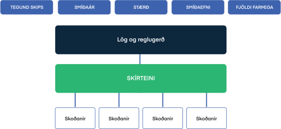

# Regluvörðurinn

Með Regluverðinum er hægt að sjá hvaða lög, reglur, skírteini og skoðanir eiga við um tiltekið skip. Þannig er hægt að nota Regluvörðinn til að finna viðeigandi skírteini sem þarf að gefa út fyrir viðkomandi skip skv. lögum og reglugerðum. 

<figure>
  
  <figcaption>Eigindi skips ákvarða skírteini og skoðanir</figcaption>
</figure>

Útgáfa viðeigandi skírteinis, eins og kveðið er á um í viðeigandi lögum eða reglum, er staðfesting á að skip hafi verið tekið út í samræmi við þær reglur og uppfylli kröfurnar. Þetta getur falið í sér t.d. mælingu á skipi, skoðun á skip o.s.frv, þ.e. eftirlit af einhverju tagi. Útgáfa á skírteini er því lokaskref í samþykktar eða skoðunarferli. 

<!--  -->

Það má líta svo á að Regluvörðurinn sé hjarta kerfisins og stærsta breytingin m.v. gömlu skipaskránna.  Skoðanir á skipi tengjast í raun alltaf útgáfu á ákveðnu skips skírteini.

## Regluvörðurinn í verki

 `SKÍRTEINI OG LEYFI` &rarr; `REGLUVÖRÐUR`

 [Regluvörðurinn](https://skutantest.samgongustofa.is/complianceOfficer/3002)  

 
<!-- |  Eigindi skips    | Reglugerðir, skírteini og skoðanir |
|-----------|-----------|
| |    | -->

Þegar komið er inn í Regluvörðinn fyrir tiltekið skip þá birtast þau lög og reglugerðir sem gilda um skipið.

Þau skips skírteini sem eru nauðsynleg fyrir tiltekið skip samkvæmt þau lögum og reglum sem um það gilda birtast sem blár hnappur.

Þær reglubundnu skoðanir sem tengjast viðkomandi skírteini birtast sem gulur hnappur.

Þegar eftirfarandi upplýsingar um skip eru tiltækar í Skútunni er hægt að birta lista yfir hvaða lög og reglur gilda og þannig hvaða skírteini skipið þarfnast: 

- Tegund skips <Badge text="*" />
- Smíði / kjölur lagður (dagsetning og ár)
- Stærð (BT, BRL, mesta lengd, skráningarlengd) <Badge text="*" />
- Smíðaefni

Einnig er að hægt að sjá hvernig Regluvörðurinn breytist með því breyta eigindum skips á vinstri hlið skjámyndar og smella á  `Birta` hnappinn neðst. Þannig sýnir Regluvörðurinn í Skútunni hvaða lög, reglur, skírteini og skoðanir eiga við eftir því hver eigindi skipsins eru.