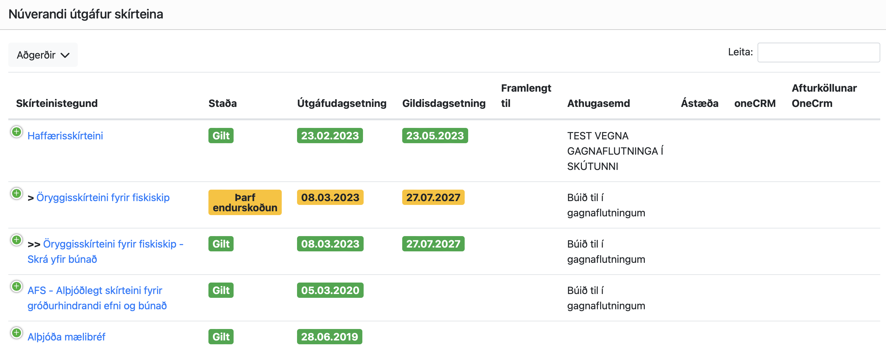

# Útgáfa skips skírteina

<!-- [[toc]] -->
<!-- ### Title <Badge type="info">custom element</Badge>

{{ 1 + 1 }}

## Markdown Content

The count is: {{ count }}

<button :class="$style.button" @click="count++">Increment</button>

 -->

Útgáfa skírteinis er alltaf staðfesting á að eftirlit hafi leitt í ljós að tilteknar kröfur í reglum séu uppfylltar. Þannig eru öll mælibréf gefin út eftir að skipið hefur verið mælt og útreikningar á tonna tölum hafa verið yfirfarnar og samþykktar (lengdir, breiddir, dýptir, brúttó- og nettótonn).

Sum skírteini skipa hafa aðeins **útgáfudagsetningu**, en engan gildistíma. Það á t.d. við með skírteini eins og
- mælibréf og skrásetningarskírteini, 
- íslenskt mælibréf
- alþjóðamælibréf
- þjóðernisskírteini 

Eðli þessara skírteina er þannig, að þau eru gefin út þegar ákveðin eigindi skipsins hafa verið staðfest (t.d. lengd eða tonnatala), en það eru ekki framkvæmdar eða skilgreindar reglubundnar skoðanir í lögum/reglum hvað varðar ofantöldu skírteinin.

<!--  -->

<!-- <figure>
  
  <figcaption>Nauðsynleg skírteini skips</figcaption>
</figure> -->

Ýmis önnur skírteini skipa hafa hins vegar bæði útgáfu dagsetningu og gildistíma.  Í daglegu tali er stundum talað um “períódísk skírteini” því þau eru endurnýjuð reglubundið þegar staðfest hefur verið í skipaskoðun, að skipið uppfyllir tilteknar kröfur varðandi t.d. smíði, björgunar- og öryggisbúnað, fjarskiptabúnað, siglingatæki, mengunarvarnarbúnað osfrv.  Dæmi um slík skírteini eru: **haffærisskírteini** og **öryggisskírteini**.

Tvö algengustu skírteinin, sem skip fá útgefin eru haffærisskírteini og öryggisskírteini.  Algengustu skoðanir sem skip undirgangast eru síðan: búnaðarskoðun, vél- og rafmagnsskoðun, bolskoðun (skoðun ofan sjólínu, með skipið á floti), botnskoðun (skoðun neðan sjólínu), öxul- og stýrisskoðun, kranaskoðun.  Þessar skoðanir tengjast alltaf annað hvort haffærisskírteini eða öryggisskírteini skipsins.

> **Haffærisskírteini** er gefið út fyrir öll skip óháð stærð og tegund

> **Öryggisskírteini** er hins vegar gefið út fyrir öll farþegaskip óháð stærð og öll önnur skip yfir 15 m að mestu lengd, sem notuð eru í atvinnuskyni  

Þegar búið er að velja skip til að skoða í kerfinu þá sjást þau skírteini, sem eiga við skipið í  skjámyndunum Útgáfa skips skírteina og Yfirlit yfir útgefin skírteini. Nánar er fjallað um þetta í þessum kafla.

## Gildistími skips skírteina

Gildistími skips skírteinis tekur mið af:

1. #### Gerð skírteinis
> og skoðunar fyrirkomulagi (skoðunarhring og skoðunarglugga) skipsins gagnvart því skírteini
> - **Farþegaskip**, 5 ára skoðunarhringur, skoðunargluggi er alltaf - 3 mánuðir mv. afmælis dagsetningu, 12 mánaða öryggisskírteini
> - Allar aðrar tegundir skipa, 5 ára skoðunarhringur, skoðunargluggi er venjulegast + 3 mánuðir mv. afmælis dagsetningu (nema í lok skoðunarhrings, þá er bara - 3 mánuðir), 60 mánaða öryggisskírteini

2. ####  Niðurstöðu skoðana (dæming 0, 1, 2 eða 3)

Eftir því skip verða stærri í metrum og tonnum þá gilda meiri kröfur um þau og þá þurfa skip að undirgangast fleiri skoðanir tengt þessum kröfum og fá útgefið viðeigandi skips skírteini því til staðfestingar. Afmælis dagsetningu, skoðunarhring og skoðunarglugga er nánar lýst `í þessum og í 4. kafla.` **TODO - hlekkur**

Kerfið stillir upp á myndrænan hátt skoðunarhringnum, þ.e. hvenær skoðanir skips skulu fara fram næstu 5 árin, en skoðanirnar skulu fara fram ár hvert miðað við afmælis dagsetningu.  Afmælisdagsetningin skilgreinir því skoðunarhringinn (skoðunarfyrirkomulagið):

<figure>
  
  <figcaption>5 ára skoðunarhringur farþegaskips</figcaption>
</figure>

<u>Ein mikilvæg breyting</u> frá því sem verið hefur, er sú að með nýju tölvukerfi þá mun dæming 2 í skoðun þýða, að hægt er að gefa út skips skírteinið með <u>fullum gildistíma</u>.  Hins vegar, ef niðurstaða skoðunar er dæming 2 þá þarf að framkvæma endurskoðun innan mest 3 mánaða líkt og áður, <u>en ef endurskoðun er ekki framkvæmd innan tímamarka þá fellur skips skírteinið, sem skoðunin tengist **úr gildi**</u>.  Þetta þýðir að `haffærisskírteinið` fellur úr gildi og ef skipið er með `öryggisskírteini` þá fellur það einnig úr gildi.  Þetta gerist sjálfvirkt, enda ber eiganda að kalla eftir endurskoðun ef hana þarf að framkvæma.  Þegar endurskoðun er síðan framkvæmd og athugasemdir teknar út, þá hrekkur viðkomandi skírteini aftur í gildi sjálfvirkt, að því gefnu að engin dæming 3 sé á skipinu.

Þá er mikilvægt að hafa í huga, að ef niðurstaða skoðunar er dæming 3 þá telst skipið óhaffært og ekki er hægt að gefa út viðeigandi skírteini, sem skoðunin tegnist.

## Öryggisskírteini

Gerð skírteinis: **Öryggisskírteini**

Ef skip skal fá útgefið öryggisskírteini þá eru hefðbundnar skoðanir eins og búnaðarskoðun, vél- og rafmagnsskoðun, bolskoðun (skoðun ofan sjólínu, með skipið á floti), botnskoðun (skoðun neðan sjólínu), öxul- og stýrisskoðun, kranaskoðun **alltaf** tengdar öryggisskírteininu.

::: details Öryggisskírteini farþegaskipa
Eins og áður sagði fá öll farþegaskip óháð stærð og öll skip af öðrum tegundum, sem notuð eru í atvinnuskyni og eru yfir 15 m að mestu lengd útgefið öryggisskírteini.  Skoðanir þessara skipa sem varða  grunnþætti skipsins og búnaðar þess s.s. smíði (bolskoðun, botnskoðun, vél- og rafmagnsskoðun, öxul- og stýrisskoðun), björgunar- og öryggisbúnaðar (búnaðarskoðun),  fjarskiptabúnað (fjarskiptaskoðun)  tilheyra öryggisskírteininu.  Í daglegu tali er sagt að þessar skoðanir “falli undir” öryggisskírteinið.  Það þýðir, að til að gefa út öryggisskírteinið þá þurfa þessar skoðanir að hafa verið framkvæmdar með fullnægjandi niðurstöðu. Það mega vera dæmingar 1 og 2, en dæming 3 þýðir að skipið er óhaffært eins og áður sagði.  Um skoðanir er meira fjallað í kafla 4.

Fyrir farþegaskip er öryggisskírteinið almennt með 12 mánaða gildistíma, en getur mest orðið 15 mánuðir.   Ástæðan fyrir þessu er að skoðanir farþegaskipa, skulu framkvæmast með 12 mánaða millibili miðað við afmælisdagsetningu öryggisskírteinisins, en þessar skoðanir mega hefjast allt að því 3 mánuðum fyrir afmælisdagsetninguna.  Í daglegu tali er talað um -3 mánaða skoðunarglugga.  Ef skoðanar gagnvart öryggisskírteini farþegaskip eru framkvæmdar þegar skoðunarglugginn opnast (3 mánuðum áður en kemur að afmælisdagsetningunni) þá getur gildistími öryggisskírteinisins orðið mest 12+3 mánuðir = 15 mánuðir, ef nýtt öryggisskírteini er gefið út í framhaldi af skoðun.  Ef skoðanir eru hins vegar framkvæmdar í lok skoðunarglugga getur gildistími öryggisskírteinis mest orðið 12 mánuðir.  Dagsetning gildir til (dagur og mánuður), sem skráð er á öryggisskírteinið er afmælisdagsetning skírteinisins. Þetta er sú dagsetning (dagur og mánuður) þegar skoðunarhring lýkur (lok skoðunarhrings, sem er þá einnig upphaf á nýjum skoðunarhring) þ.e. 5 árum eftir að hringurinn hófst.

Ef skoðanir sem tengjast öryggisskírteininu eru ekki framkvæmdar innan skoðunargluggans og komið er út fyrir gluggann, þá fellur skírteinið sjálfkrafa úr gildi.

**Öryggisskírteini fiskiskipa / flutningaskipa / annara skipa, sem eru 15 m og lengri að mestu lengd, notuð í atvinnuskyni.**

Þessi skip fá öll útgefið öryggisskírteini, en hámarks gildistími þeirra er um 5 ár (60 mánuðir).  Öryggisskírteinið er gefið út í upphafi skoðunarhrings þegar skoðanir, sem tilheyra skírteininu hafa verið framkvæmdar með fullnægjandi hætti. 

Skoðanir þessara skipa sem varða  grunnþætti skipsins og búnaðar þess s.s. smíði (bolskoðun, botnskoðun, vél- og rafmagnsskoðun, öxul- og stýrisskoðun), björgunar- og öryggisbúnaðar (búnaðarskoðun),  fjarskiptabúnaðar (fjarskiptaskoðun)  tilheyra öryggisskírteininu og í  daglegu tali er sagt að þessar skoðanir “falli undir” öryggisskírteinið.  Það þýðir, að til að gefa út öryggisskírteinið þá þurfa þessar skoðanir að hafa verið framkvæmdar með fullnægjandi niðurstöðu.

Skoðanir, sem falla undir 5 ára öryggisskírteini mega venjulegast framkvæmast allt að því 3 mánuðum fyrir til 3 mánuðir eftir afmælisdagsetninguna.  Í daglegu tali er talað um +/- 3 mánaða skoðunarglugga.

Ef skoðanir sem tengjast öryggisskírteininu eru ekki framkvæmdar innan skoðunargluggans og komið er út fyrir gluggann, þá fellur skírteinið sjálfkrafa úr gildi.
:::

## Haffærisskírteini

Gerð skírteinis: **Haffærisskírteini**

Öll skip fá útgefið haffærisskírteini. Haffærisskírteini er svokallað “regnhlífar skírteini” og er staðfesting á að skipið uppfyllir allar kröfur, sem um skipið gilda.  Það þýðir að ef skipið er með allar skoðanir í gildi og er með öll önnur nauðsynleg skips skírteini í gildi þá má gefa út haffærisskírteini.  Þó að skip sé með öryggisskírteini og grunn skoðanir eins *búnaðarskoðun*, *vél- og rafmagnsskoðun* osfrv. tengist öryggisskírteininu, þá skal skip jafnframt fá útgefið haffærisskírteini.

Í þeim tilvikum, að skip fá ekki útgefið öryggisskírteini (þ.e. öll skip undir 15 m, að undanskyldum farþegaskipum ásamt allir skemmtibátar), þá falla skoðanir skipsins undir haffærisskírteinið (bolskoðun, botnskoðun, vél- og rafmagnsskoðun, öxul- og stýrisskoðun, búnaðarskoðun, fjarskiptaskoðun)

::: details Haffærisskírteini - farþegaskip
Gildistími á haffærisskírteini getur mest orðið 15 mánuðir fyrir farþegaskip.  Í rauninni má segja að gildistíminn á haffærisskírteini verði sá sama og á öryggisskírteini farþegaskips.  Ástæðan fyrir þessu er að skoðanir farþegaskipa skulu framkvæmast með 12 mánaða millibili miðað við afmælisdagsetningu.  Ef skoðanir gagnvart öryggisskírteini farþegaskips eru framkvæmdar þegar skoðunarglugginn opnast (3 mánuðum áður en kemur að afmælisdagsetningunni) þá getur gildistími öryggisskírteinisins orðið mest 12+3 mánuðir = 15 mánuðir.  Ef skoðanir fara fram í lok skoðunarglugga getur öryggisskírteinið orðið mest 12 mánuðir og sama gildir þá um haffærisskírteinið.
:::
